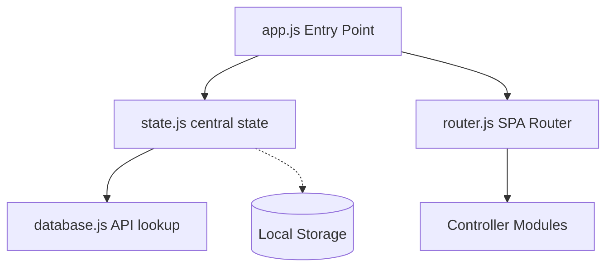

# Codebase Reference Map

This reference document catalogs the architecture, modules, and component indexes of the **ColinsChartsMacros** project. It serves as a static, high-precision map of all project resources, allowing coding assistants to locate exact line ranges, CSS class structures, or state methods immediately without scanning massive source files.

---

## 🏗️ Core Architecture & State Synchronization

The application is structured as a vanilla single-page Progressive Web App (PWA) with a central state controller and tabbed sub-controllers. 

### 1. [app.js](file:///c:/Users/Colin's%20PC/.gemini/antigravity/scratch/colins-charts-macros/app.js)
* **Lines 1-50**: Main PWA error boundaries (`showCrashAlert`) and global runtime uncaught exception bounds.
* **Lines 51-81**: Domain initialization sequences invoking `init()` on all active modules sequentially.
* **Lines 82-98**: Midnight rollover check (polls clock every 30 seconds to automatically refresh date context at 00:00).
* **Lines 100-158**: Low-latency gesture accelerator (`handleGlobalPointerDown`) which bypasses mobile click delay and forces instant keyboard focusing/text selection on form inputs.

### 2. [state.js](file:///c:/Users/Colin's%20PC/.gemini/antigravity/scratch/colins-charts-macros/state.js)
* **Lines 9-52**: `AppState.data` Schema definition:
  * `standardGoals`: Default budget parameters (Protein, Carbs, Fats, Calories).
  * `dailyGoals`: overrides keyed by `YYYY-MM-DD`.
  * `meals`: Logged item arrays keyed by `YYYY-MM-DD`.
  * `weights`: Imperial/Metric logged weights keyed by `YYYY-MM-DD`.
  * `settings`: Conversion metrics (`lbs`/`kg`), Calorie Cycling day maps, and `typesenseConfig` parameters.
  * `recipes` / `customBarcodes`: Custom databases.
* **Lines 63-145**: Deep Schema Migration (`loadFromStorage`). Safely reconciles old database versions, converts legacy formats, and initializes Typesense parameters.
* **Lines 156-200**: Calorie Cycling Engine (`getGoalsForDate`). Adjusts base target calories with flat or percentage surpluses for high-calorie days and proportionally scales protein, carbs, and fats.
* **Lines 202-222**: `showToast(message)` layout trigger.
* **Lines 224-263**: Timestamp parsing and user-friendly relative date-string formatters.

### 3. [database.js](file:///c:/Users/Colin's%20PC/.gemini/antigravity/scratch/colins-charts-macros/database.js)
* **Lines 12-123**: Sequential barcode lookup cascading fallback engine:
  1. **Open Food Facts API v2** (energy-kcal, proteins, carbohydrates, fat)
  2. **USDA FoodData Central API** (Foundation/Survey datasets)
  3. **UPCitemdb Trial API** (metadata match fallback)
* **Lines 125-260**: `COMMON_WHOLE_FOODS` fallback whole food database for high-quality generic offline searches.
* **Lines 262-571**: Levenshtein, `fuzzyScore`, and `queryTypesense` engines. Implements direct Typesense cluster queries and client-side fuzzy string matching fallback.

### 4. [router.js](file:///c:/Users/Colin's%20PC/.gemini/antigravity/scratch/colins-charts-macros/router.js)
* **Lines 12-58**: Initializes active panels, binds navbar listeners, and registers popstate back actions.
* **Lines 60-96**: Panel groups navigator and back-gesture logic.
* **Lines 98-220**: `navigate(tabName)`. Handles:
  * Pruning scanner streams when leaving camera pages.
  * Viewport-level scroll position backups and restorative auto-scroll reflows.
  * Focus triggers (instantly focusing primary inputs on tab entry).
* **Lines 222-240**: Refresh routing router.

### 5. [scanner.js](file:///c:/Users/Colin's%20PC/.gemini/antigravity/scratch/colins-charts-macros/scanner.js)
* **Lines 18-110**: `start(context)`. Initializes `Html5Qrcode` camera stream wrapper configured for 1D wide barcodes (EAN/UPC) with custom ideal aspect constraints.
* **Lines 115-169**: `stop()`. Safely prunes dynamic HTML video elements to prevent memory leaks and waits out race conditions.

### 6. [charts.js](file:///c:/Users/Colin's%20PC/.gemini/antigravity/scratch/colins-charts-macros/charts.js)
* **Lines 15-147**: `renderChart(...)`. Generates a 7-day Chart.js line graph of actual weight logs with subtle alpha gradients.
* **Lines 153-198**: `computeRegressionDataset(...)`. Calculates standard linear regression line of best fit ($y = mx + c$) using **least-squares linear regression modeling**.
* **Lines 203-264**: Average weight and net weekly changes status calculator.

---

## 🗂️ index.html Screen Section Index

[index.html](file:///c:/Users/Colin's%20PC/.gemini/antigravity/scratch/colins-charts-macros/index.html) is exactly **2,329 lines** long. Below is a line-indexed catalog of all core containers:

| Line Range | Container ID | Purpose / Content |
| :--- | :--- | :--- |
| **L1 - L133** | Global Headers & Modals | Fonts, external script CDNs (`html5-qrcode`, `Chart.js`), and top toolbar |
| **L134 - L396** | `panel-dashboard` | **Dashboard**: Calorie eaten/target count dials, remaining deficits, and red-gradient overage progress tracks |
| **L397 - L642** | `panel-food` | **Food Tracker**: Eaten meal list, long-press actions, 7-day daily history bar charts |
| **L643 - L868** | `panel-weight` | **Weight Entry**: Daily logging status card, 7-day progress chart, and persistent scanner action cards |
| **L869 - L1050** | `panel-strategy` | **Calorie Cycling**: Enable switches and day-by-day surplus/percentage cycling overrides |
| **L1051 - L1154** | `panel-weight-planner` | **MSJ Planner**: Sex, age, physical activity select dropdowns, target rates, and expected timeline results |
| **L1155 - L1294** | `panel-weight-budgets` | **Macro Budgets**: Custom nutrient budget parameters and diet presets grid buttons |
| **L1295 - L1464** | `panel-settings` | **Settings**: Backups (CSV/JSON), clear data triggers, mock logs, Typesense configurations, and Renpho CSV import overlay |
| **L1465 - L1632** | `panel-food-selector` | **Food Selector**: Recipes list, food log history lookup tab, online search-as-you-type fuzzy subpage, and collapsible Quick Add form |
| **L1633 - L1900** | `panel-add-recipe` | **Recipe Builder**: Ingredients tally compiler, custom ingredient input cards, and totals tracker |
| **L1901 - L2035** | `panel-weight-history-detail` | **Weight Details**: Deep history chart, zoom buttons (3 days to 2 years), panning, and goal timelines |
| **L2036 - L2225** | Global Modals Overlay | Overlays for confirmation, copy/move segment logs, inline edits, and weight pruners |
| **L2226 - L2329** | Safety Scripts & Imports | Diagnostic capturing error blocks, protocol guards, and PWA script lists |

---

## 🎨 styles.css Layout & Component Index

[styles.css](file:///c:/Users/Colin's%20PC/.gemini/antigravity/scratch/colins-charts-macros/styles.css) spans **3,462 lines**. Below is the catalog of styling layouts:

* **L1 - L43**: **CSS Variables / Design System**. Core HSL color maps, layout tokens, transitions, and Outfit/Inter fonts.
* **L44 - L112**: Global reset parameters, scrollbar scroll tracks, and simulating mobile phone wrappers on ultra-wide desktop monitors.
* **L113 - L149**: Custom calendar toolbar selector.
* **L150 - L217**: Single Page App viewport panel transition layer animations.
* **L218 - L306**: Bar-based calorie progress bars (includes overage red gradient properties).
* **L307 - L374**: Macronutrient progress bar layouts (P/C/F specific HSL tokens).
* **L375 - L515**: Eaten meals log list, sliding card layout details, and custom delete items buttons.
* **L516 - L597**: html5-qrcode camera capture viewport container styles.
* **L598 - L725**: Core form selectors, inputs focus borders, switches, and clickable elements.
* **L726 - L874**: Database searched preview cards (calories scales, portion dropdown adjustments).
* **L875 - L994**: Custom foods and ingredients forms.
* **L995 - L1068**: Chart.js container wrappers.
* **L1069 - L1225**: Goal configuration layout styling.
* **L1226 - L1338**: Mifflin-St Jeor timeline calculator boxes and warning cards.
* **L1339 - L1418**: Global utility helpers and floating action classes.
* **L1419 - L1490**: Interactive tool navigation rows for sliding setups.
* **L1491 - L1574**: Calorie 7-day log history bar tracks.
* **L1575 - L1650**: Calorie Cycling weekday layout forms.
* **L1651 - L1700**: Tactile switch buttons.
* **L1701 - L1790**: Toast notifications transitions overlays.
* **L1791 - L1856**: High calorie re-feed badges.
* **L1861 - L1996**: Food selector search input fields and online database results tags.
* **L1997 - L2164**: Scaled nutrient value displays inside preview cards.
* **L2165 - L2375**: Recipe Builder lists, compiled components, and dynamic inline input cards.
* **L2376 - L2423**: Persistent bottom scanned action elements.
* **L2424 - L2543**: Immersive camera scanning setups (highlighting targeting overlays).
* **L2544 - L2646**: Clickable dashboard weight history card layouts.
* **L2647 - L2841**: Horizontally scrollable detailed history chart layouts (sticky Y-axis, zoom bar grids).
* **L2923 - L2936**: Long press active gesture scaling overlays.
* **L2941 - L3153**: Bottom Pinned Scan Barcode & Add Food actions (copied to Dashboard, Food and Weight tabs).
* **L3154 - L3228**: Modals overlays layout.
* **L3229 - L3462**: Scientific diet explanation grids and calorie safety budget breakdown text.

---

## 🎮 Controller Modules Map (`controllers/`)

### 1. [calendar.js](file:///c:/Users/Colin's%20PC/.gemini/antigravity/scratch/colins-charts-macros/controllers/calendar.js)
* **`shiftDay(offsetDays)`**: Decrements/increments active dates on current time zones and refreshes the current tab page cleanly.
* **`updateLabel()`**: Updates calendar headers relatively ("Today", "Yesterday", "Tomorrow" or standard format strings).

### 2. [dashboard.js](file:///c:/Users/Colin's%20PC/.gemini/antigravity/scratch/colins-charts-macros/controllers/dashboard.js)
* **`render()`**: Summarizes all logged meals on selected dates, tallies net carbs dynamically (subtracting fiber), calculates target energy using the standard macro multiplier formula, and handles red-gradient overage tracks.
* **`updateMacroRow(macroName, eaten, target)`**: Animates macro tracks with custom HSL starting gradients transitioning to pure red when exceeding 105% of budgets.

### 3. [food.js](file:///c:/Users/Colin's%20PC/.gemini/antigravity/scratch/colins-charts-macros/controllers/food.js)
* **`render()`**: Lists meals logged on selected dates and renders 7-day calorie history bar charts.
* **`showMoveModal(meal)`**: Handles touch-hold long-press actions to copy or move food records between Today, Tomorrow, or custom date pickers (added in copy entries task).
* **`showEditModal(meal)`**: Handles clicked log edits. Scales macros and calories dynamically using proportional weight factors if a user overrides the weight value.

### 4. [food_selector.js](file:///c:/Users/Colin's%20PC/.gemini/antigravity/scratch/colins-charts-macros/controllers/food_selector.js)
* **`setTabActive(tabName)`**: Manages selector subpages, focuses the search inputs, and auto-selects text.
* **`getFoodHistory()`**: Walks through historical log databases and sorts them in reverse chronological order (newest logged items first).
* **`selectFoodItem(food, type, clickedEl)`**: Implements inline toggling (opening the portion selector directly below clicked items and auto-scrolling to the top).
* **`logSelectedFood()`**: Computes multipliers and submits results back to Daily Meals logs or Recipe Builders based on active contexts.
* **Collapsible Quick Add Form Formulator (Lines 214-313)**: Supports quick carbs, protein, and fat inputs with live calorie calculations.

### 5. [recipe.js](file:///c:/Users/Colin's%20PC/.gemini/antigravity/scratch/colins-charts-macros/controllers/recipe.js)
* **`addCustomIngredientSubmit()`**: Validates, maps, and registers custom manual ingredients to compilers.
* **`renderIngredients()`**: Compiles total recipe weights, energy metrics, and fiber totals sequentially.
* **`saveRecipe()`**: Compiles complete modular elements into `AppState.data.recipes` and resets builder pages.

### 6. [scanner_view.js](file:///c:/Users/Colin's%20PC/.gemini/antigravity/scratch/colins-charts-macros/controllers/scanner_view.js)
* **`initContext(context)`**: Binds camera stream toggles and manual fields across four contexts (Dashboard, Food, Recipe, and Weight).
* **`triggerProductLookup(context, barcode)`**: Cascades lookup queries. Pre-fills names/brands on unmatched codes and displays manual registration templates.
* **`registerCustomBarcode(context)`**: Dynamically maps custom portion weights, normalizes nutrients back to standard 100g database bases, and saves locally to prevent duplicate requests.

### 7. [settings.js](file:///c:/Users/Colin's%20PC/.gemini/antigravity/scratch/colins-charts-macros/controllers/settings.js)
* **Diet Presets Configurator (Lines 11-90, 258-396)**: Core science engine mapping scientific rationales, joint stood stands, and clinical study lists for normal, high, and ultra protein diets. Clamps max protein kcal safely to 45% of total budgets.
* **`calculateTargetPlanner()` (Lines 557-680)**: Mifflin-St Jeor TDEE bodyweight loss rate planner. Outputs weekly timeline estimates and triggers health/safety warnings for aggressive rate drops or low daily calories.
* **`applyPlannerTarget()`**: Recalculates standard base target calories and scales macronutrient targets proportionally.
* **`toggleWeightUnit(targetUnit)` (Lines 748-817)**: Converts all historical weight logs, profile settings, and weekly rates accurately between Imperial `lbs` and Metric `kg` without data loss.
* **`importRenphoCSV(...)` (Lines 859-1003)**: Parses Renpho smart scale CSV exports, extracts measurement times and weights, performs automatic unit conversions if necessary, and saves logs.
* **Backups Manager (Lines 1005-1102)**: Exports Google Sheets compatible CSV logs and raw JSON database files.

### 8. [strategy.js](file:///c:/Users/Colin's%20PC/.gemini/antigravity/scratch/colins-charts-macros/controllers/strategy.js)
* **`init()` / `render()`**: Binds Calorie Cycling weekend switches, tracks high-calorie day configs (+ kcal flat surpluses or + % percentage increases), and dynamically reveals day inputs.

### 9. [weight.js](file:///c:/Users/Colin's%20PC/.gemini/antigravity/scratch/colins-charts-macros/controllers/weight.js)
* **`logWeight()`**: Logs daily weights rounded to 1 decimal place.
* **`silentRecalcAndApply(...)` (Lines 104-164)**: Recalculates TDEE using Mifflin-St Jeor when a weight is logged, proportionally scales daily standard/override macros, and saves. This links logged weights directly to dynamic daily goals.

### 10. [weight_detail.js](file:///c:/Users/Colin's%20PC/.gemini/antigravity/scratch/colins-charts-macros/controllers/weight_detail.js)
* **`zoomIn()` / `zoomOut()`**: Traverses 15 zoom levels (3 days to 2 years).
* **`panLeft()` / `panRight()`**: Pans chronological ranges backward or forward by 60% of active windows.
* **`renderChart()` (Lines 88-292)**: Computes least-squares linear regression over visible data points and sets dynamic padding borders.
* **`renderStats(...)`**: Displays historical starting references, current logs, net changes, expected timelines, and calculated goal dates.

---

> [!TIP]
> **Performance Optimization**: In future edits, reference specific line ranges in this document to directly target edits in [index.html](file:///c:/Users/Colin's%20PC/.gemini/antigravity/scratch/colins-charts-macros/index.html) and [styles.css](file:///c:/Users/Colin's%20PC/.gemini/antigravity/scratch/colins-charts-macros/styles.css) without scanning.

> [!NOTE]
> **Modifying Controllers**: If modifying a controller's UI layout or event listeners, remember that most controllers use standard non-module scoping. Ensure modifications do not leak variables into the global `window` object.
